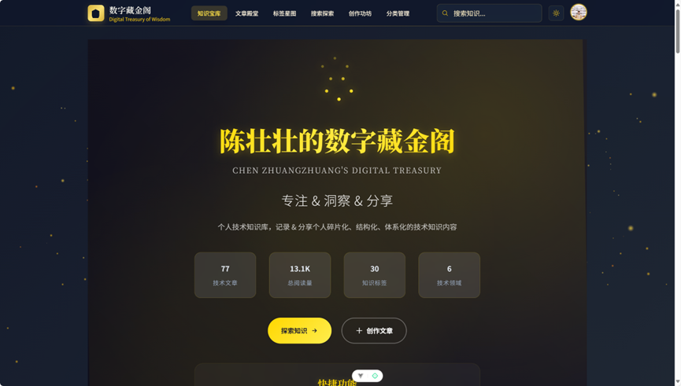
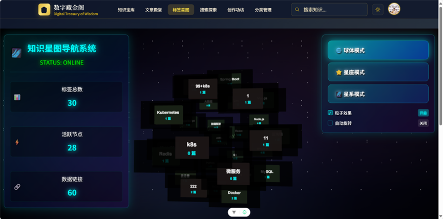
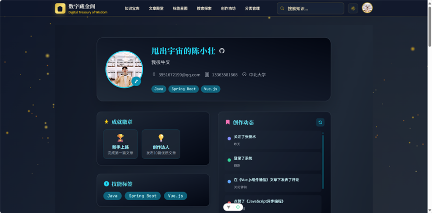
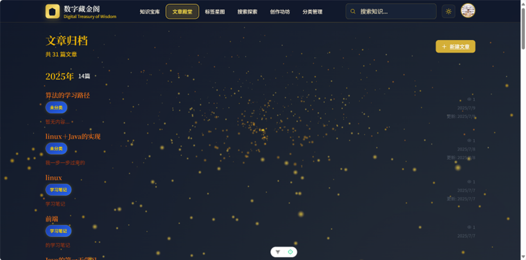
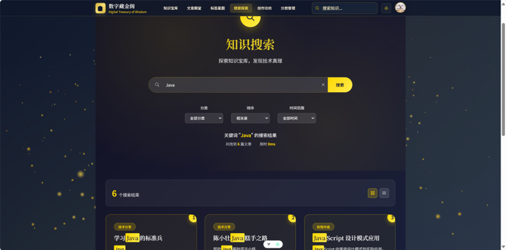
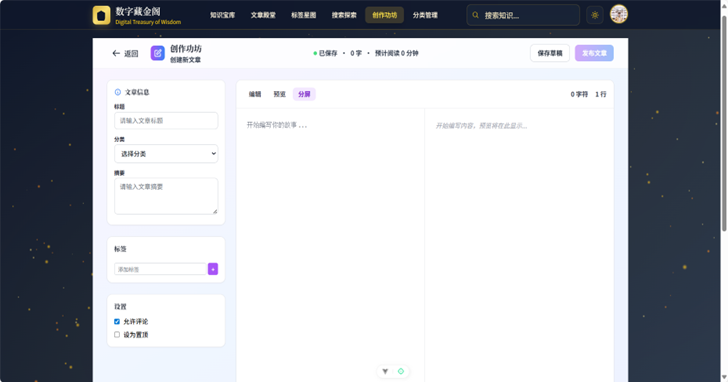
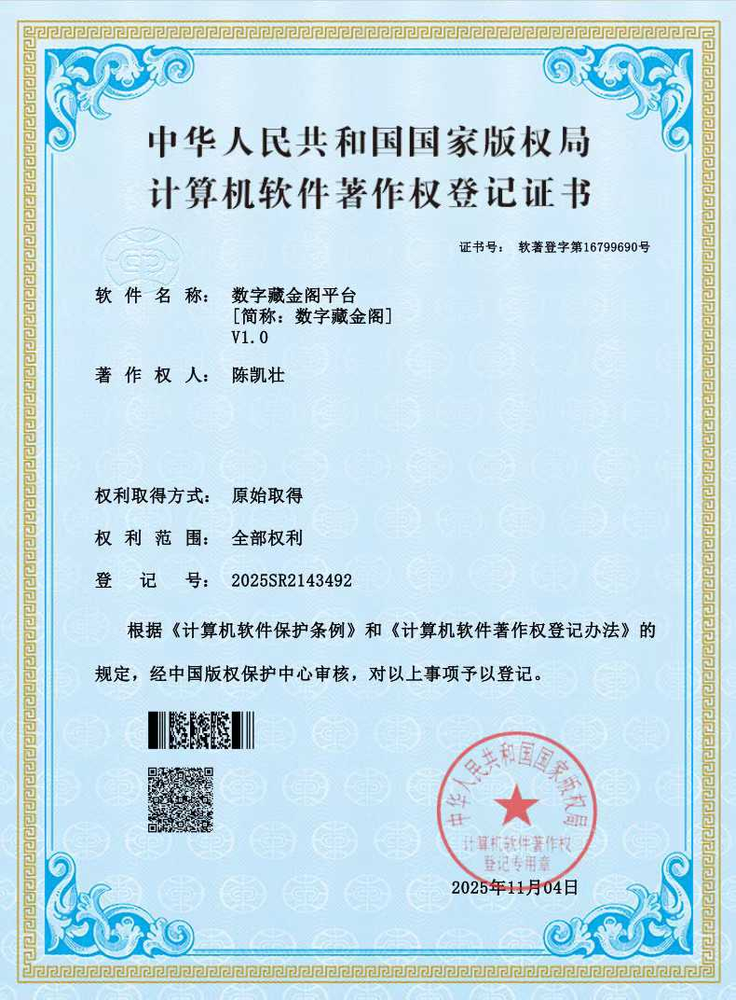

<div align="center">

# 🌌 Digital-Library-Cave
### 数字藏金阁· 个人知识管理系统

**“为碎片化知识构建的第二大脑 —— 优雅、高效、沉浸”**


[🎥 功能演示](#-核心功能演练-showcase) • [🛠 技术架构](#-技术栈与架构-tech-stack) • [🚀 快速启动](#-快速部署-quick-start)

---
</div>

## 💡 项目背景与价值 (Introduction)

**Digital-Library-Cave** 不仅仅是一个博客，它是一套**全栈式数字资产管理解决方案**。

针对当前信息碎片化、知识检索难的痛点，本项目通过现代化的技术栈，构建了一个集**沉浸式阅读**、**结构化归档**、**全文检索**于一体的平台。项目历经完整的软件工程生命周期开发，注重代码规范与用户体验。

> **核心价值：**
> * ✨ **极致交互**：极简主义 UI 设计，降低认知负载。
> * 🚀 **高性能**：优化的前后端分离架构，秒级响应。
> * 🛡️ **原创认证**：拥有独立软件著作权，代码自主可控。

---

## 🛠 技术栈与架构 (Tech Stack)

*(此处采用业内通用的徽章展示，请根据您实际使用的技术保留或修改)*

**前端 (Frontend):**


**后端 (Backend):**


**数据与部署 (Data & DevOps):**


---

## 📸 核心功能演练 (Showcase)

我们深知**“颜值即正义，体验即核心”**。以下是系统核心模块的实机运行截图。

### 1. 门户与导航系统 (Portal & Navigation)
采用大图视觉引导，配合清晰的标签（Tab）切换机制，通过视觉层级引导用户注意力。

| **沉浸式首页 (Front Page)** | **多维导航 (Tab Navigation)** |
| :---: | :---: |
|  |  |
| *极简设计语言，突出核心Slogan* | *逻辑清晰的分类索引，快速定位模块* |

### 2. 内容分发与阅读 (Content Delivery)
实现了基于卡片流的瀑布展示与深度优化的文章渲染引擎，支持代码高亮与 Markdown 实时解析。

| **知识列表 (Blog Feed)** | **沉浸阅读模式 (Article View)** |
| :---: | :---: |
|  |  |
| *图文并茂的卡片式布局，信息密度适中* | *排版精美的正文区域，提供舒适阅读流* |

### 3. 全栈检索与生产力 (Search & Productivity)
集成了高性能检索引擎与所见即所得（WYSIWYG）编辑器，实现知识的快速录入与提取。

| **全局检索 (Global Search)** | **创作者中心 (Editor)** |
| :---: | :---: |
|  |  |
| *支持关键词模糊匹配，毫秒级响应* | *功能完备的编辑器，支持实时预览* |

---

## 🏆 知识产权与资质 (Certification)

本项目具备高度的完整性与创新性，并已正式获得 **中华人民共和国国家版权局** 颁发的计算机软件著作权登记证书。

<div align="center">
  
  <br>
  <em>( 软件著作权登记证书展示 - 自主研发证明 )</em>
</div>

---

## 🚀 快速部署 (Quick Start)

如果您希望在本地复现本项目，请执行以下标准操作：

### 1. 环境准备
确保您的开发环境已安装以下依赖：
* JDK 1.8+
* Node.js & npm
* MySQL 5.7+

### 2. 克隆仓库
```bash
git clone git@github.com:HeyZhuang/Digital-Library-Cave.git
3. 启动服务
(请根据实际项目结构调整)

Bash

# 1. 数据库配置
# 导入 sql 文件夹下的 init.sql 到本地 MySQL

# 2. 启动后端
cd backend
mvn spring-boot:run

# 3. 启动前端
cd frontend
npm install && npm run dev
🤝 贡献与联系 (Contribution)
HeyZhuang 期待与更多开发者交流！

📧 Email: ccckz@protonmail.com
🐛 Issue: 发现Bug或提出新功能建议

⭐ Star: 如果您觉得本项目对您有帮助，请点击右上角 Star 支持！

<div align="center"> Copyright © 2025 HeyZhuang. All Rights Reserved. </div>


-----
